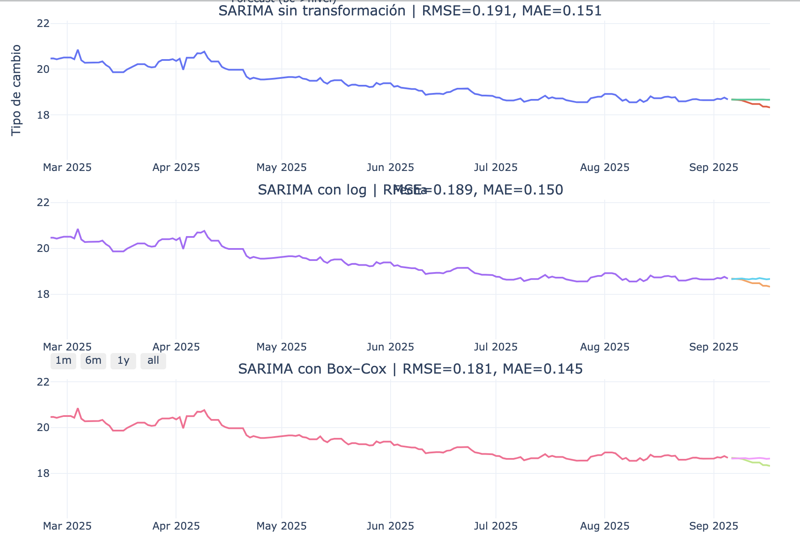

# Examen_1_ModelosNoLineales
Un repositorio colaborativo para el examen 1 de modelos no lineales 

---
## Integrantes del Equipo

- **Esteban Javier Verumen Nieto**  
- **Mariana Salomé García González**  
- **Remi Heredia Pérez**  
- **Ivanna Camerota Curiel**  
- **Juan Pablo Echeverría Villaseñor**

---

---

##  Contexto

###  FIX (Tipo de Cambio FIX)

 Es un *tipo de cambio oficial* publicado por el *Banco de México*.  

 Representa cuántos *pesos mexicanos equivalen a 1 dólar estadounidense (MXN/USD)*.  

 Se calcula con base en operaciones del mercado cambiario en México y se publica *una vez al día*.  

 *Se usa para:*  
•⁠  ⁠Facturación oficial.  
•⁠  ⁠Operaciones contables.  
•⁠  ⁠Liquidaciones de comercio exterior.  
•⁠  ⁠Referencia legal en contratos.  

 Es un *dato regulado y único*, que sirve como referencia oficial en México.  

---

  

---

##  Objetivo del Proyecto

Desarrollar un **modelo SARIMA (Seasonal ARIMA)** que:  
1. Analice el comportamiento histórico del FIX .  
2. Identifique tendencias, estacionalidad y patrones relevantes.  
3. Genere proyecciones confiables a corto y mediano plazo.  

Los datos se obtienen directamente desde la **API de Banxico**, garantizando **fuentes oficiales y actualizadas**.

---

##  Metodología
1. **Obtención de datos**  
   - Conexión a la API de Banxico.  
   - Limpieza y preparación de la serie temporal.
  

2. **Análisis exploratorio (EDA)**  
   - Visualización de tendencias y estacionalidad.  
   - Pruebas de estacionariedad (ADF Test).
   - Selección de los datos que se utilizarán para el modelo.
     
        •⁠  ⁠Se obtuvieron los registros históricos del *Tipo de Cambio FIX* directamente de la API de Banxico.  
        •⁠  ⁠El dataset original contiene información desde *1991* hasta la fecha actual.  
        •⁠  ⁠Para fines de modelado y evaluación, se aplicó un *filtro temporal* considerando únicamente los *últimos 5 años de observaciones*.

3. **Construcción del modelo SARIMA**  
   - Identificación de parámetros (p, d, q, P, D, Q, s).
   - Aplicación de distintas transformaciones. 

4. **Evaluación del modelo**  
   - Métricas: AIC, BIC, MAE, MAPE.  
   - Validación sobre datos de prueba.  

5. **Proyección**  
   - Forecast del FIX en el horizonte seleccionado.  
   - Visualización con intervalos de confianza.
  
## Selección del Modelo SARIMA

### 1. Elección de los órdenes (p, d, q)

-   **d (diferenciación no estacional):**  
    Se aplicaron pruebas de estacionariedad (ADF, KPSS) y análisis visual de la serie. El tipo de cambio FIX mostró tendencia en ciertos periodos, por lo que se aplicó una diferenciación para estabilizar la media.
    
-   **p y q (orden autorregresivo y de medias móviles):**  
    Se utilizaron las gráficas de **Autocorrelation Function (ACF)** y **Partial Autocorrelation Function (PACF)**:
    
    -   Un corte significativo en el PACF sugirió un orden **p** inicial.
        
    -   Se sugirió un orden **q** inicial debido a que se visualizaron más de 40 lags significativos, lo que podría indicar estacionalidad.
        
    -   Se probaron distintas combinaciones y se seleccionó la que minimizó el RMSE y maximizó el Accuracy del modelo.
        

### 2. Elección de los órdenes estacionales (P, D, Q, s)

-   **s (periodicidad estacional):**  
    Se determinó con base en la frecuencia de los datos (diarios hábiles) y en el análisis exploratorio, donde se observan patrones semanales. Se estableció `s = 5` para capturar estacionalidad semanal de días hábiles.
    
-   **D (diferenciación estacional):**  
    Evaluada a partir de estacionalidad visible en la descomposición de la serie. Se aplicó diferenciación estacional solo si la serie no resultaba estacionaria tras el primer paso.
    
-   **P y Q (órdenes AR y MA estacionales):**  
    Identificados mediante picos en la ACF y PACF en los rezagos múltiplos de `s`.
    

### 3. Justificación del uso de SARIMA

-   El tipo de cambio FIX presenta **tendencias de largo plazo** con fluctuaciones de corto plazo.
    
-   Los datos muestran **patrones recurrentes de estacionalidad semanal** (ligeros cambios entre inicio y fin de semana).
    
-   El modelo SARIMA permite capturar:
    
    -   Tendencia → con diferenciación no estacional.
        
    -   Estacionalidad → con componentes estacionales (P, D, Q, s).
        
    -   Ruido y fluctuaciones → con los términos AR y MA.
        

En comparación con un ARIMA simple, SARIMA fue más adecuado porque incorporó la estacionalidad semanal, lo que redujo los errores de pronóstico y mejoró el ajuste en la validación.

---
Metodología del jupyter notebook
---
## 📈 Histórico de la Serie

| Fecha       | Tipo de Cambio |
|------------:|---------------:|
| 1991-11-12  | 3.0735 |
| 1991-11-13  | 3.0712 |
| 1991-11-14  | 3.0718 |
| 1991-11-15  | 3.0684 |
| 1991-11-18  | 3.0673 |

**Corte 2021–2025:**  

---

## 🧹 Limpieza de Datos
Se imputaron valores de días no hábiles con el valor del día anterior.

| Fecha       | Tipo de Cambio |
|------------:|---------------:|
| 2025-09-15  | 18.3635 |
| 2025-09-16  | 18.3635 |
| 2025-09-17  | 18.3257 |

---

## 🔀 División Train/Test

---

## 📊 Estacionariedad
Se aplicaron **ADF** y **KPSS** → serie no estacionaria.  
Después de 1 diferenciación (d=1) la serie se vuelve estacionaria.

| Prueba | Estadístico | p-value | Conclusión |
|------:|-------------|--------|-----------|
| ADF (sin diferencia) | -1.45 | 0.55 | No estacionaria |
| KPSS (sin diferencia) | 2.03 | 0.01 | No estacionaria |
| ADF (d=1) | -12.95 | 0.0000 | Estacionaria |
| KPSS (d=1) | 0.07 | 0.10 | Estacionaria |

---

## 🪓 Descomposición STL

---

## 🔎 ACF y PACF

**Interpretación:**  
- **p=1:** primer lag en PACF significativo.  
- **q=1:** primer lag en ACF significativo.  
- **s=5:** periodicidad semanal (días hábiles).

---

## 🔧 Modelo SARIMA
\[
SARIMA(1,1,1)(1,1,1)_5
\]

 - Dada la heterocedasticidad de una serie de naturaleza estocástica como lo son las monedas de cambio, optamos por una transformación box-cox para poder estabilizar la varianza y buscar una distribución más normal de la data que tenemos.
 
---

## 📑 Métricas Finales
| Transformación | MAPE | Accuracy | RMSE | SMAPE |
|---------------:|-----:|--------:|-----:|------:|
| **Sin transformación** | 0.82% | 99.18% | 0.19 | 0.82% |
| **Logarítmica**        | 0.82% | 99.18% | 0.19 | 0.81% |
| **Box-Cox**           | 0.79% | 99.21% | 0.18 | 0.78% |

---

## 🔮 Predicciones del Modelo

A continuación se muestran las **predicciones generadas con el modelo SARIMA**, comparadas contra el conjunto de prueba y visualizadas en dos versiones:  

- **Figura 11:** Predicciones individuales del modelo con sus intervalos de confianza.  
- **Figura 12:** Comparación de las tres transformaciones (Raw, Log, Box-Cox) en un mismo gráfico.

## 🔮 Predicciones del Modelo

> **Conclusión:** Box-Cox es la mejor transformación → menor error, mayor precisión.
